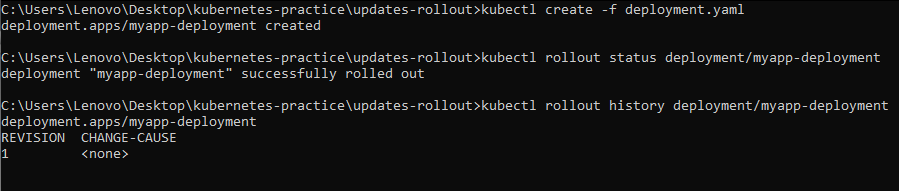
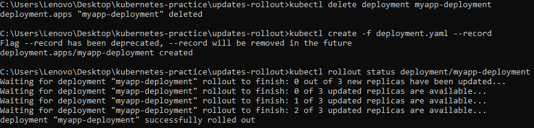
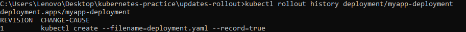
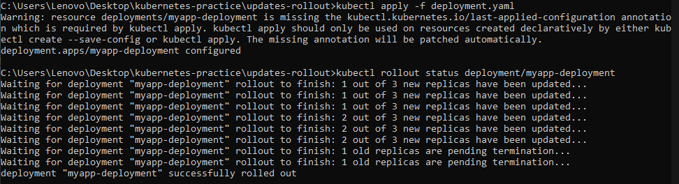
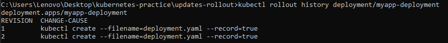
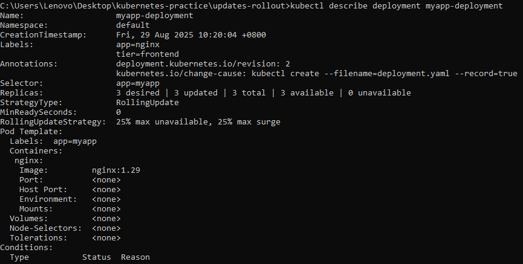
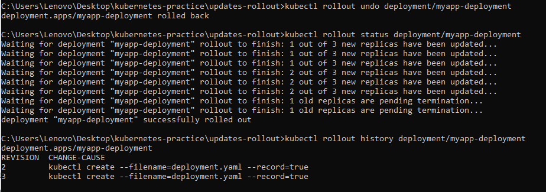

# Deployment

## :pushpin: Description

In this folder, we will demonstrate how updates, rollbacks, and rollouts works in Kubernetes. Using the configuration file in this folder, we explore Kubernetes' Rollout strategy in deployment and how we can version our deployments to better serve our users.

## :rocket: Execution

Follow this steps when executing this project

1.  :open_file_folder: Clone and explore the repository.

    ```bash
    # clone through ssh
    git clone git@github.com:MHSoquiat/kubernetes-practice.git

    #clone through http
    git clone https://github.com/MHSoquiat/kubernetes-practice.git

    # change directory
    cd kubernetes-practice/4-updates-rollout

    # list and check the files
    ls
    # deployment.yaml   - kubernetes configuration file for deployment
    # README.md         - contains execution instructions
    ```

2.  :hammer: Build and validate the deployment configuration file by executing the following commands

    ```bash
    # ensure kubernetes is running and there is no existing deployments in your local device
    kubectl get all

    # create deployment
    kubectl create -f deployment.yaml

    # check the rollout status of your deployment 
    kubectl rollout status deployment/myapp-deployment

    # check the rollout history of our deployment
    kubectl rollout history deployment/myapp-deployment
    ```

Here is the expected output for the commands:



> Notice that there is no rollout history recorded, because we did not specified it in our deployment

3. :wrench: Delete the deployment and create a new deployment that has enabled rollout record history

    ```bash
    # delete existing deployment
    kubectl delete deployment myapp-deployment

    # enable rollout history recording
    kubectl create -f deployment.yaml --record

    # check the rollout status of your deployment 
    kubectl rollout status deployment/myapp-deployment

    # check the rollout history of our deployment
    kubectl rollout history deployment/myapp-deployment
    ```

Here is the expected output for the commands:





> Here you can see the first version of our deployment. Now let's assume there is an error in our deployment and we need to update our deployment. See next step.

4. :scroll: Update the Configuration file. Replace the container image from nginx -> nginx:1.29

    ```yaml
    apiVersion: apps/v1
    kind: Deployment
    metadata:
    name: myapp-deployment
    labels:
        tier: frontend
        app: nginx
    spec:
    selector:
        matchLabels:
        app: myapp
    replicas: 3
    template:
        metadata: 
        name: nginx-2
        labels:
            app: myapp
        spec:
        containers:
            - name: nginx
            image: nginx:1.29 # -> Update to this version 
    ```

5. :watch: Once the configuration file is updated, let's apply the changes using the following command:

    ```bash
    # apply changes to the deployment
    kubectl apply -f deployment.yaml --record

    # check the rollout status of your deployment 
    kubectl rollout status deployment/myapp-deployment

    # check the rollout history of our deployment
    kubectl rollout history deployment/myapp-deployment
    ```

Here is the expected output for the commands:





6. :mag_right: Inspect and validate if we successfully implemented the updates on our container image:

    ```bash
    # inspect the deployment information
    kubectl describe deployment myapp-deployment
    ```

Here is the expected output for the commands:



> Let's assume once again that our update has been faulty and we would want to rollback to the previous version, see next step.

7. :rewind: Rollback to a deployment version using the following command:

    ```bash
    # rollback to the previous stable version
    kubectl rollout undo deployment/myapp-deployment

    # check rollback status
    kubectl rollout status deployment/myapp-deployment

    # check rollout history
    kubectl rollhout history deployment/myapp-deployment

Here is the expected output for the commands:



> You might notice that in the version history, version 1 is missing or deleted. This is because our deploymenr rolled back to version 1, and it is now the 3rd version

## :bookmark_tabs: Key Takeaways
- Enable and track rollout history.

- Perform safe application updates using versioned container images.

- Validate changes in running Deployments.

- Roll back to previous stable versions to ensure reliability

This repository provides hands-on practice in managing Kubernetes Deployments, a critical resource for maintaining applications in containerized environments. By following the steps, learners gain practical knowledge of how deployments, ReplicaSets, and pods interact in Kubernetes. The repository serves as a solid foundation for understanding declarative configuration, scaling applications, and validating deployment health in real-world DevOps workflows.
