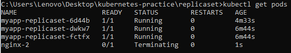

# Replica Sets

## :pushpin: Description

This folder contains coding demonstration and exercises on how to create a Replica Set using a Kubernetes configuration file (YAML)

## :rocket: Execution

Follow this steps when executing this project

1.  :open_file_folder: Clone and explore the repository.

    ```bash
    # clone through ssh
    git clone git@github.com:MHSoquiat/kubernetes-practice.git

    #clone through http
    git clone https://github.com/MHSoquiat/kubernetes-practice.git

    # change directory
    cd kubernetes-practice/replicaset

    # list and check the files
    ls
    # custom-pod.yaml   - kubernetes configuration file for a custom pod
    # README.md         - contains execution instructions
    # replicaset.yaml   - kubernetes configuration file for a replica set
    ```

2.  Build and validate the replica set by executing the following commands

    ```bash
    # create replicaset
    kubectl create -f replicaset.yaml

    # check whether replicaset is created successfully 
    kubectl get replicaset

    # check the pods created under the replicaset
    kubectl get pods
    ```

## :clipboard: Experiment Testing
> Creating an identical pod to the pods in our replica set to see how our replica set would handle this additional pod.

1.  Build and validate the pod by executing the following commands

    ```bash
    # create pod using the custom-pod.yaml
    kubectl create -f custom-pod.yaml

    # check whether replicaset is created successfully 
    kubectl get pods
    ```

---
Here is the expected output for step 1:

> As you can see, the custom pod created is already terminating as we exceed our desired replica
---

2. Next let us try to scale down and see what would happen

    ```bash
    # Adjust the replica number with this command:
    kubectl scale replicaset myapp-replicaset --replicas=2
    ```


## :bookmark_tabs: Key Takeaways
- Learned how to define ReplicaSets with YAML.

- Verified ReplicaSet creation and managed pods via kubectl.

- Observed self-healing behavior when duplicate pods are created.

- Practiced scaling ReplicaSets up and down.

- Understood ReplicaSets as a foundation for higher-level Kubernetes objects.

This project highlights how ReplicaSets maintain the desired state of Pods in a Kubernetes cluster. By experimenting with duplicate pod creation and scaling, learners gain valuable insight into pod lifecycle management, self-healing, and cluster consistency. These fundamentals are crucial for transitioning into Kubernetes Deployments, which extend ReplicaSets with advanced capabilities like rolling updates and version control for cloud-native applications.
